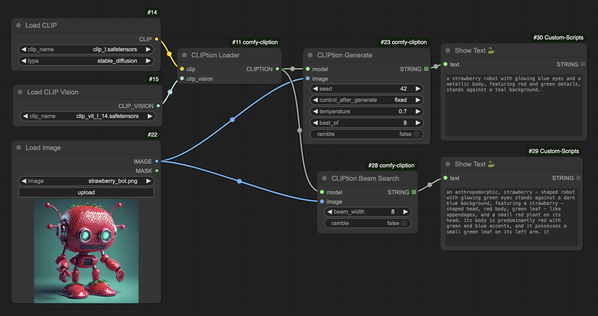
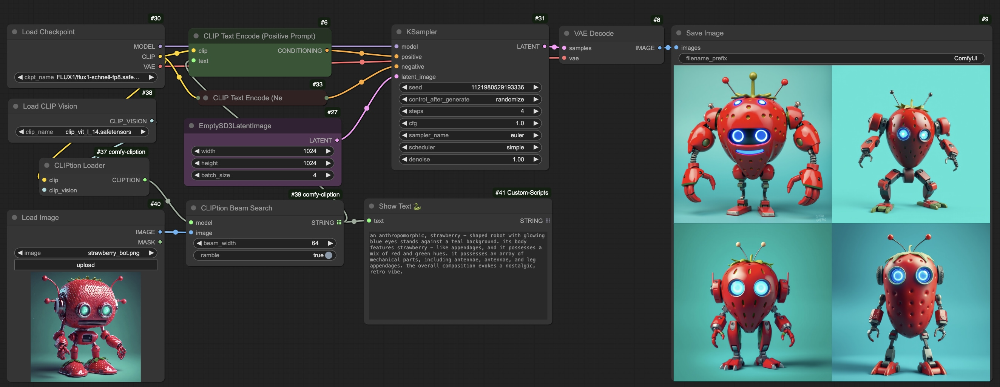
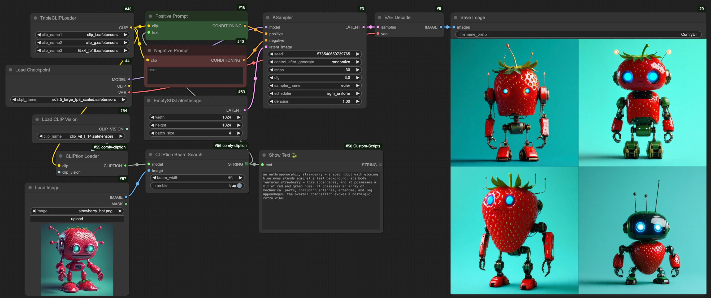

**CLIPtion** is a fast and small captioning extension to the [OpenAI CLIP](https://github.com/openai/CLIP/) ViT-L/14 used in Stable Diffusion, SDXL, SD3, FLUX, etc. Feed the CLIP and CLIP_VISION models in and CLIPtion powers them up giving you caption/prompt generation in your workflows!

I made this for fun and am sure bigger dedicated caption models and VLM's will give you more accurate captioning, but this guy is tiny, fast, reuses what you already have loaded, and has options to give better CLIP alignment so give it a try if you like!

Big thanks to [Ben Egan](https://github.com/ProGamerGov), [SilentAntagonist](https://huggingface.co/SilentAntagonist), [Alex Redden](https://github.com/aredden), [XWAVE](https://twitter.com/XWAVEart), and [Jacky-hate](https://github.com/Jacky-hate) whose synthetic caption datasets I included in the training.


# Example workflows


[CLIPtion-example.json](media/CLIPtion-example.json)


[CIPtion-flux-schnell.json](media/CIPtion-flux-schnell.json)


[CLIPtion-SD3.5L.json](media/CLIPtion-SD3.5L.json)

# Installation

1. Clone this repo to your ComfyUI/custom_nodes directory.
```shell
cd custom_nodes
git clone https://github.com/pharmapsychotic/comfy-cliption.git
pip install -r comfy-cliption/requirements.txt
```
2. Optionally download [CLIPtion_20241219_fp16.safetensors](https://huggingface.co/pharmapsychotic/CLIPtion/blob/main/CLIPtion_20241219_fp16.safetensors) and put in your `ComfyUI/custom_nodes/comfy-cliption` directory. You can skip this step to let it auto-download on first use to your `HF_HOME` cache.
4. Restart ComfyUI

You should have the CLIP L text encoder already from SD, SDXL, SD3, FLUX. You also need the CLIP L vision encoder for the Load CLIP Vision node. You can download this through the ComfyUI Manager > Model Manager > search "clip vision large" > click Install for openai/clip-vit-large.

The example workflows use the [ComfyUI-Custom-Scripts](https://github.com/pythongosssss/ComfyUI-Custom-Scripts.git) node for previewing the caption strings. So you'll probably want to install that as well if you don't have it already. 

# Nodes

## CLIPtion Loader

If `CLIPtion_20241219_fp16.safetensors` is not already downloaded (as in step 2 of Installation) then the loader will automatically download the CLIPtion model for you the first time it is run from the [HuggingFace CLIPtion repo](https://huggingface.co/pharmapsychotic/CLIPtion). It gets stored in the [HuggingFace cache dir](https://huggingface.co/docs/huggingface_hub/en/guides/manage-cache) (controlled by `HF_HOME` environment variable). 

## CLIPtion Generate

Create caption from an image or batch of images.
* `temperature` - controls randomness in generation - higher values produce more diverse outputs, lower values are more focused and predictable
* `best_of` - generates this many captions in parallel and picks the one with best CLIP similarity to the image
* `ramble` - forces generation of full 77 tokens

## CLIPtion Beam Search

Deterministic search for caption from an image or batch of images. Less "creative" than Generate node.
* `beam_width` - how many alternative captions are considered in parallel - higher values explore more possibilities but take longer
* `ramble` - forces generation of full 77 tokens

