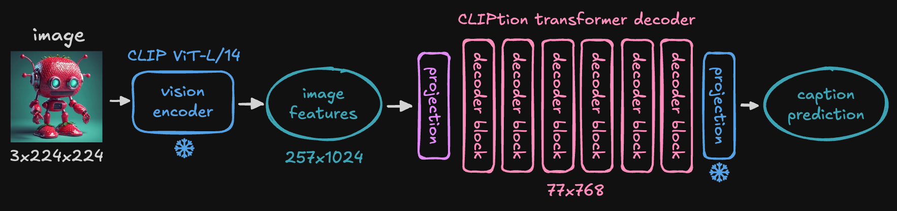

**CLIPtion** is a fast and small captioning extension to [OpenAI CLIP](https://github.com/openai/CLIP/) ViT-L/14. You already have ViT-L loaded when using using Stable Diffusion, SDXL, SD3, FLUX, etc and with just an extra *100MB memory* you can include caption/prompt generation in your workflows!

# Example workflow

...

# Nodes

## CLIPtion Loader

The loader will automatically download the CLIPtion model for you the first time it is run from the [HuggingFace CLIPtion repo](https://huggingface.co/pharmapsychotic/CLIPtion). It gets stored in the [HuggingFace cache dir](https://huggingface.co/docs/huggingface_hub/en/guides/manage-cache) (controlled by `HF_HOME` environment variable). You could also manually download the safetensor file and put in comfy-cliption directory and that will be used instead.

## CLIPtion Generate

Create caption from an image or batch of images.
* `temperature` - controls randomness in generation - higher values produce more diverse outputs, lower values are more focused and predictable
* `best_of` - generates this many captions in parallel and picks the one with best CLIP similarity to the image
* `ramble` - forces generation of full 77 tokens

## CLIPtion Beam Search

* `beam_width` - how many alternative captions are considered in parallel - higher values explore more possibilities but take longer
* `ramble` - forces generation of full 77 tokens

